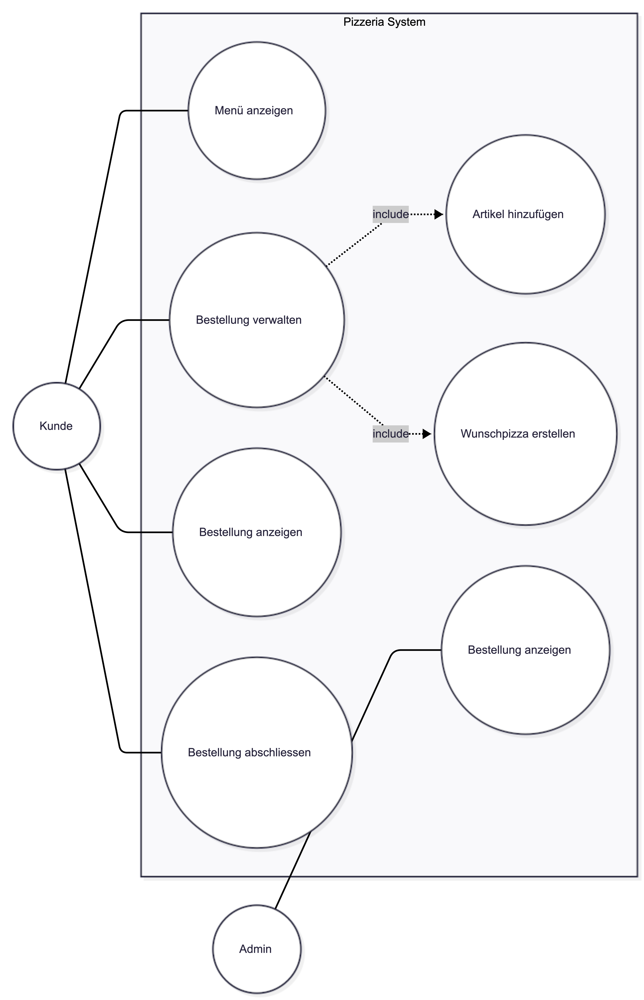
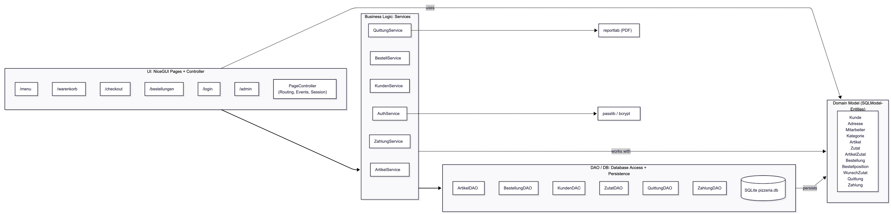

# Pizzeria Sunshine — Browserbasiertes Bestellsystem

Eine browserbasierte Pizzeria-Bestell-App, entwickelt im Rahmen des OOP-Moduls FS26 an der FHNW.

Die App erlaubt Kunden, Pizzas und Getränke online zu bestellen, eine **Wunschpizza** mit eigenen Zutaten zusammenzustellen, eine Lieferadresse auszuwählen, online zu bezahlen und automatisch eine Quittung als PDF zu erhalten. Mitarbeiter können Bestellungen übernehmen und das Menü pflegen.

> **Hinweis:** Diese Version ist die Weiterentwicklung unserer CLI-App aus dem 1. Semester. Aus dem Konsolen-Skript wird ein vollständiges Web-System mit Datenbank, Schichten-Architektur und mehreren OOP-Patterns.

---

## Team

| Name | Rolle / Bereich |
|------|-----------------|
| Mohammed Alhassan | Bestellung & Checkout |
| Younus Tariq | Menü & Daten |
| Irem Camkiran | Kunde, Auth & Quittung |

---

## Tech-Stack

- **Python 3.12**
- **NiceGUI** — UI-Framework (Browser-Frontend)
- **SQLModel** — ORM (Pydantic + SQLAlchemy)
- **SQLite** — Datenbank (eine Datei `pizzeria.db`)
- **reportlab** — PDF-Erzeugung für Quittungen
- **passlib / bcrypt** — Passwort-Hashing
- **pytest** — Tests

---

## User Stories

1. **Menü anzeigen**
   Als Kunde möchte ich das Menü anzeigen können, damit ich sehe, welche Pizzas und Getränke verfügbar sind.

2. **Artikel in den Warenkorb legen**
   Als Kunde möchte ich Produkte aus dem Menü in den Warenkorb legen, damit ich meine Bestellung zusammenstellen kann.

3. **Wunschpizza erstellen**
   Als Kunde möchte ich meine eigene Pizza mit Zutaten zusammenstellen können, damit ich eine individuelle Bestellung machen kann.

4. **Bestellung abschliessen & speichern**
   Als Kunde möchte ich meine Bestellung abschliessen können, damit sie gespeichert wird und ich sie später nachvollziehen kann.

5. **Quittung erhalten**
   Als Kunde möchte ich nach der Bestellung eine Quittung erhalten, damit ich einen Nachweis über meine Bestellung habe.

---

## Use Cases



Hauptakteure:

- **Kunde** — Menü ansehen, Bestellung verwalten (Artikel hinzufügen, Wunschpizza erstellen), Bestellung abschliessen, Bestellung anzeigen
- **Admin / Mitarbeiter** — Bestellungen anzeigen und bearbeiten, Menü pflegen

---

## ER-Modell (Datenbank-Sicht)


> Quelle: [er_modell.mmd](docs/er_modell.mmd)

Das ER-Modell beschreibt die 12 Datenbank-Tabellen und ihre Beziehungen.

**Wichtigste Entitäten:**

- `Kunde` mit mehreren `Adressen` und mehreren `Bestellungen`
- `Bestellung` referenziert Kunde, Lieferadresse und (nullable) bearbeitenden Mitarbeiter
- `Bestellposition` als 1:N zur Bestellung, mit Snapshot des Einzelpreises zum Bestellzeitpunkt
- `Artikel` ↔ `Zutat` über die Junction-Tabelle `Artikel_Zutat` mit Attribut `menge` (Standard-Rezepte)
- `Bestellposition` ↔ `Zutat` über `Wunsch_Zutat` für Wunschpizza-Zutaten
- `Quittung` und `Zahlung` jeweils 1:1 zur Bestellung

**Designentscheidungen:**

- `mitarbeiter_id` in `Bestellung` ist nullable — beim Anlegen ist noch kein Mitarbeiter zugewiesen
- Eigene `Adresse`-Tabelle, weil ein Kunde mehrere Lieferadressen haben kann
- Junction-Tabellen mit Zusatzattribut (`menge` in `Artikel_Zutat`) statt einfacher N:M-Verknüpfung
- `passwort_hash` getrennt für Kunde und Mitarbeiter (zwei Login-Pfade)

---

## UML-Klassendiagramm (Code-Sicht)


> Quelle: [uml_klassendiagramm.mmd](docs/uml_klassendiagramm.mmd)

Das UML-Diagramm zeigt die OOP-Struktur. Im Gegensatz zum ER-Modell verwenden die Klassen **Object-Referenzen** statt Foreign Keys (z. B. `Bestellung.kunde : Kunde` statt `kunden_id : int`).

**Wichtigste Klassen:**

- `Kunde`, `Adresse`, `Mitarbeiter` — Personen-Daten
- `Kategorie`, `Artikel`, `Zutat`, `ArtikelZutat` — Menü-Struktur mit Standard-Rezepten
- `Bestellung`, `Bestellposition`, `WunschPizza` — Bestell-Logik
- `Quittung`, `Zahlung` — nachgelagerte Prozesse

**Klassen mit Verhalten (nicht nur Daten):**

- `Bestellung.gesamtbetrag_berechnen()` — fasst alle Bestellpositionen zusammen
- `Bestellposition.positionsbetrag_berechnen()` — `menge × einzelpreis`
- `WunschPizza.preis_berechnen()` — `basis_preis + n × preis_pro_zutat` (kommt aus unserer existierenden Klasse)
- `Kunde.passwort_pruefen()` — Login-Logik
- `Quittung.als_pdf_speichern()` — PDF-I/O via reportlab

---

## Architektur (System-Sicht)



> Quelle: [architektur_diagramm.mmd](docs/architektur_diagramm.mmd)

### Schichten

Das System folgt einer **Layered MVC-Architektur** mit drei Hauptschichten und dem Domain Model als gemeinsame Grundlage:

1. **UI: NiceGUI Pages + PageController** — Browser-Anzeige, Routing, Events, Session-Handling
2. **Business Logic: Services** — fachliche Regeln (Mindestbestellwert, Preis-Berechnung, Wunschpizza-Validierung)
3. **DAO / DB: Database Access + Persistence** — eine DAO pro Tabelle, SQLite mit `PRAGMA foreign_keys=ON`
4. **Domain Model (Sidebar)** — die 12 SQLModel-Entities, die alle Schichten verwenden (`uses`, `works with`, `persists`)

### Design Decisions

- **MVC-Struktur (Layered MVC Variante)** — klare Trennung in View (NiceGUI), Controller-Logik (PageController + Services) und Model (SQLModel)
- **Klare Trennung der Verantwortlichkeiten** — kein SQL in den Pages, kein NiceGUI in den Services
- **Business Logic unabhängig von UI** — Services sind ohne UI testbar (pytest mit gemockten DAOs)
- **Eine DAO pro Tabelle** — Standardmethoden + tabellenspezifische Queries
- **Domain Model als gemeinsame Sprache** — alle Schichten reden über dieselben SQLModel-Klassen, kein DTO-Mapping

### Design Patterns Used

- **Model-View-Controller (Layered MVC)** — NiceGUI ist View, PageController + Services sind Controller, SQLModel-Klassen sind Model
- **Facade Pattern** — jeder Service ist eine Facade vor mehreren DAOs (z. B. `BestellService.bestellung_aufgeben()` koordiniert intern `BestellungDAO`, `ZahlungService`, `QuittungService` und reportlab)
- **Data Access Object (DAO)** — jede Tabelle hat genau eine DAO-Klasse mit gekapselten Queries
- **Repository-Charakter der DAOs** — DAOs geben Domain-Objekte zurück, kein Tupel oder Dict

### Beispiel-Flow: "Kunde bestellt eine Wunschpizza"

1. Kunde klickt im `/warenkorb` auf "Bestellen"
2. `PageController` ruft `BestellService.bestellung_aufgeben(kunde, warenkorb, adresse)`
3. `BestellService` validiert, berechnet Gesamtpreis, ruft `BestellungDAO.create()`, `ZahlungService.zahlung_initialisieren()`, `QuittungService.quittung_erzeugen()` auf
4. `QuittungService` erzeugt PDF via reportlab, ruft `QuittungDAO.create()`
5. Bestätigung wandert zurück: DAO → Service → Page → Browser

---

## Projekt-Struktur

```
pizzeria/
├── app.py                    # Einstiegspunkt (NiceGUI starten, Router)
├── pizzeria.db               # SQLite-Datei (wird automatisch erzeugt)
├── requirements.txt
├── domain/
│   └── models.py             # Alle SQLModel-Klassen
├── dao/
│   ├── artikel_dao.py
│   ├── bestellung_dao.py
│   ├── kunden_dao.py
│   ├── zutat_dao.py
│   ├── quittung_dao.py
│   └── zahlung_dao.py
├── services/
│   ├── artikel_service.py
│   ├── bestell_service.py
│   ├── kunden_service.py
│   ├── quittung_service.py
│   ├── zahlung_service.py
│   └── auth_service.py
├── pages/
│   ├── menu_page.py
│   ├── warenkorb_page.py
│   ├── checkout_page.py
│   ├── bestellungen_page.py
│   ├── login_page.py
│   ├── admin_page.py
│   └── controller.py         # PageController
├── utils/
│   ├── db.py                 # Engine + Session-Factory
│   └── pdf_generator.py      # reportlab-Wrapper
└── tests/
    ├── test_dao.py
    ├── test_services.py
    └── test_pages.py
```

---

## Setup & Installation

```bash
# Repo klonen
git clone https://github.com/<username>/Pizzeria.git
cd Pizzeria

# Virtuelle Umgebung anlegen und aktivieren
python3 -m venv venv
source venv/bin/activate          # macOS / Linux
# venv\Scripts\activate           # Windows

# Abhängigkeiten installieren
pip install -r requirements.txt

# App starten
python app.py
```

Die App läuft danach unter `http://localhost:8080` im Browser.

### Tests ausführen

```bash
pytest tests/
```

---

## Aufgabenverteilung im Team

| Person | Bereich | Komponenten |
|--------|---------|-------------|
| **Younus** | Menü & Daten | `Artikel`, `Kategorie`, `Zutat`, `ArtikelZutat` Modelle + DAOs + `ArtikelService` + `/menu` + `/admin` |
| **Mohammed** | Bestellung & Checkout | `Bestellung`, `Bestellposition`, `WunschZutat`, `Zahlung` Modelle + DAOs + `BestellService` + `ZahlungService` + `/warenkorb` + `/checkout` |
| **Irem** | Kunde, Auth & Quittung | `Kunde`, `Adresse`, `Mitarbeiter`, `Quittung` Modelle + DAOs + `KundenService` + `QuittungService` + `AuthService` + `/login` + `/bestellungen` |

Gemeinsam: `app.py`, `db.py`, `PageController`, Tests, Präsentation.

---

## Roadmap

- [x] User Stories
- [x] Use-Case-Diagramm
- [x] ER-Modell
- [x] UML-Klassendiagramm
- [x] Architektur-Diagramm
- [ ] `models.py` mit SQLModel-Klassen
- [ ] `db.py` mit Engine und Session-Factory
- [ ] DAOs implementieren
- [ ] Services implementieren
- [ ] NiceGUI-Pages + PageController
- [ ] pytest-Tests
- [ ] Abschluss-Präsentation

---

## Modul-Kontext

Dieses Projekt entsteht im Modul **Objektorientierte Programmierung (OOP)** im FS26 an der **FHNW (HSW / Hochschule für Wirtschaft)** unter Leitung des Dozenten.

Vorgaben aus dem Modul:

- Browserbasierte App in Python
- Mindestens drei Pflicht-Diagramme (ER, UML, Architektur)
- Verwendung von SQLModel + SQLite
- Saubere OOP-Struktur mit Klassen, Vererbung und Methoden
- Einsatz mindestens eines Design Patterns
